<!-- add-breadcrumbs -->
# Accounting Reports

Some of the major accounting reports are:

### General Ledger
The General Ledger is a detail report for all transactions posted to each account and for every transaction there is a Credit and Debit account so it lists them all up.

The report is based on the table GL Entry and can be filtered by many pre-defined filters like Account, Cost Centers, Party, Project and Period etc. This helps you to get a full update for all entries posted in a period against any account account. The result can be grouped by Account, Voucher/Transaction and Party with opening and closing balances for each group. In case of multi-currency accounting, there is also an option to check the amounts in any other currency than company's base currency.

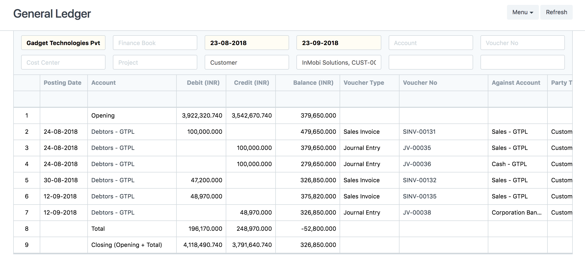

### Trial Balance

A Trial Balance is an accounting report which lists account balances for all your Accounts
(“Ledger” and “Group”) for any given reporting period. A company prepares a trial balance periodically, usually at the end of every reporting period. The general purpose of producing a trial balance is to ensure the entries in a company's bookkeeping system are mathematically correct. The totals of Debit and Credit columns must be same for any given period, to ensure the entries are correct. In Dooks, the report shows following columns:

  * Opening (Dr): Opening debit balance as on From Date
  * Opening (Cr): Opening credit balance as on From Date
  * Debit: Total Debited amount against the account between the selected period
  * Credit: Total Credited amount against the account between the selected period
  * Closing (Dr): Closing debit balance as on To Date
  * Closing (Cr): Closing credit balance as on To Date

There are some other options as well to include or exclude Period Closing Entries, show / hide accounts with zero balance and to show unclosed previous fiscal year's P&L (Income & Expenses) balances. All the figures in the report are shown in company's base currency.

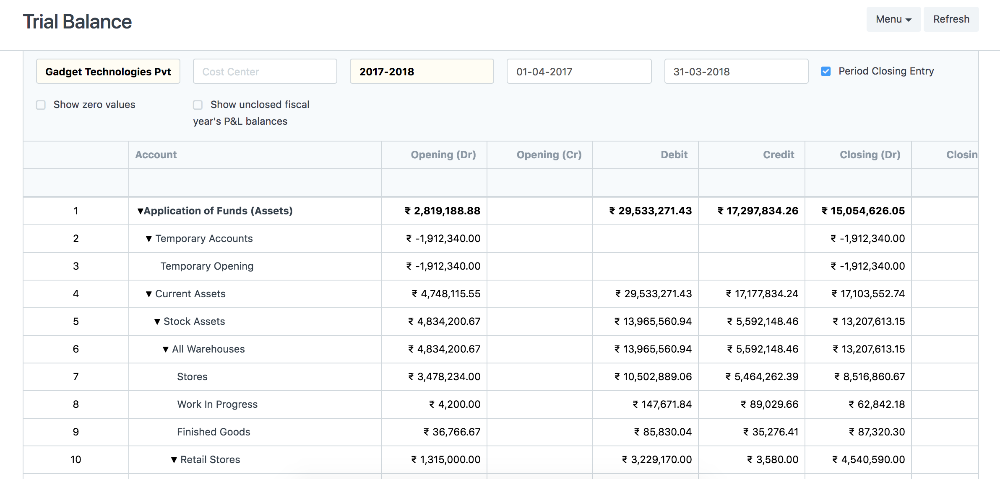

### Party Wise Trail Balance

Usually you might need to see the trail balance for your customesrs and suppliers. You can easily get for all of your customers or suppliers and also for individual.

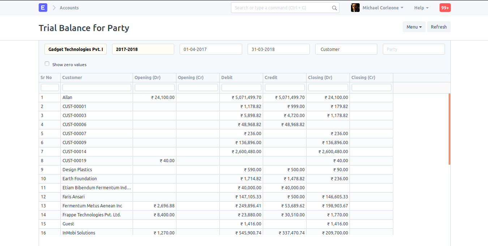

### Balance Sheet

A Balance Sheet is the financial statement of a company which states assets, liabilities and equity at a particular point in time.

The Balance Sheet in Dooks gives you more flexibility to analysis your financial position. You can run the report across multiple year to compare values. You can check values for a specific Finance Book or Cost Center. You can also choose any other currency to display the balances.

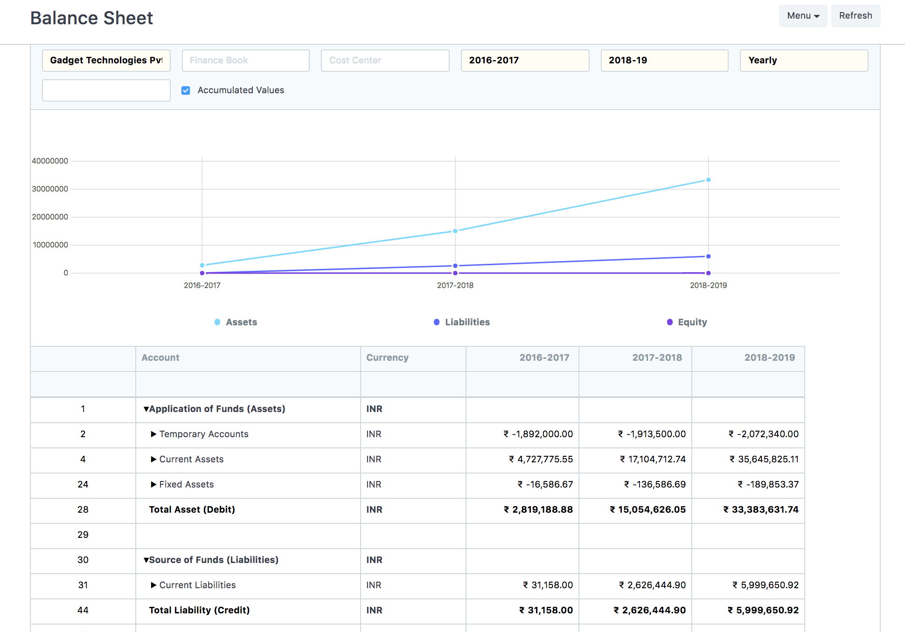

### Profit and Loss Statement

A Profit and Loss Statement is a financial statement which summarizes all the revenues and expenses in a given period. The report is also known as P&L Statement.

In Dooks, you can run the report across multiple year / period to compare the values. You can also check values for a specific Finance Book, Project or Cost Center. You can also choose any other currency to display the balances. If you are running the report to see quarterly / monthly balances, you can choose whether you want to show accumulated balances or only for each period.

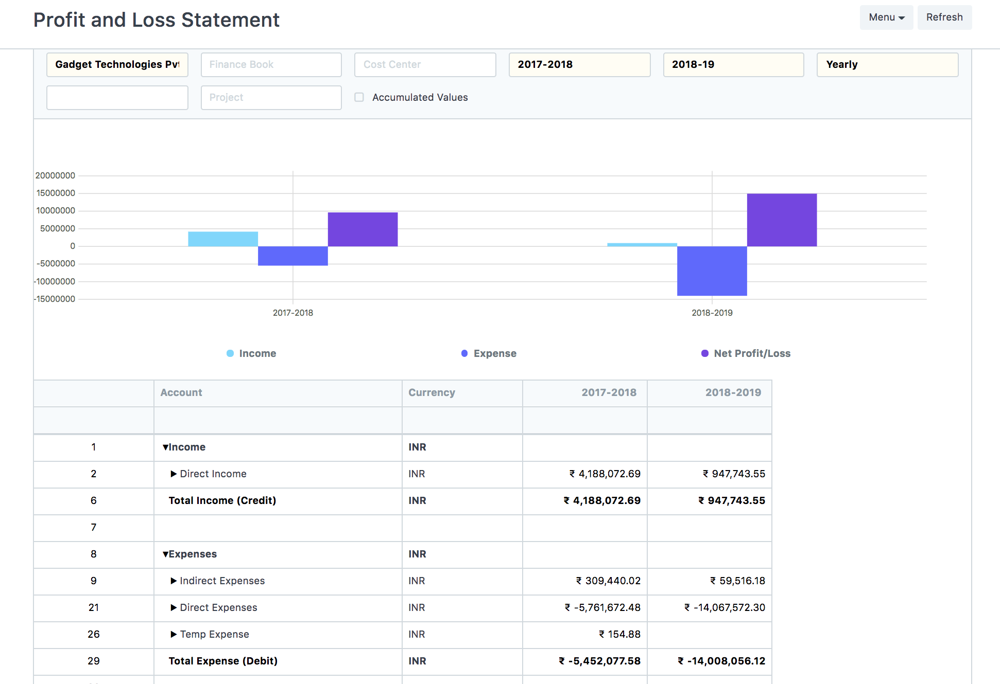

### Cash Flow Statement

A Cash Flow is a financial statement which shows the incoming and outgoing of cash or cash-equivalents for a company. It is used to analyse the liquidity position of the company.

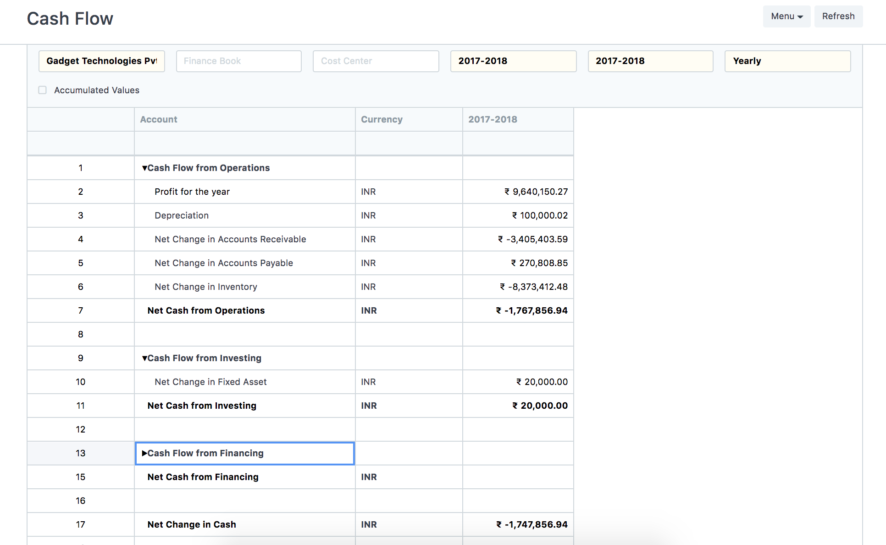

### Consolidated Financial Statements

The report shows a consolidated view of Balance Sheet, Profit and Loss Statement and Cash Flow for a group company, by merging financial statements of all the subsidary companies. It shows balances for all individual company and as well as accumulated balances for a group company.

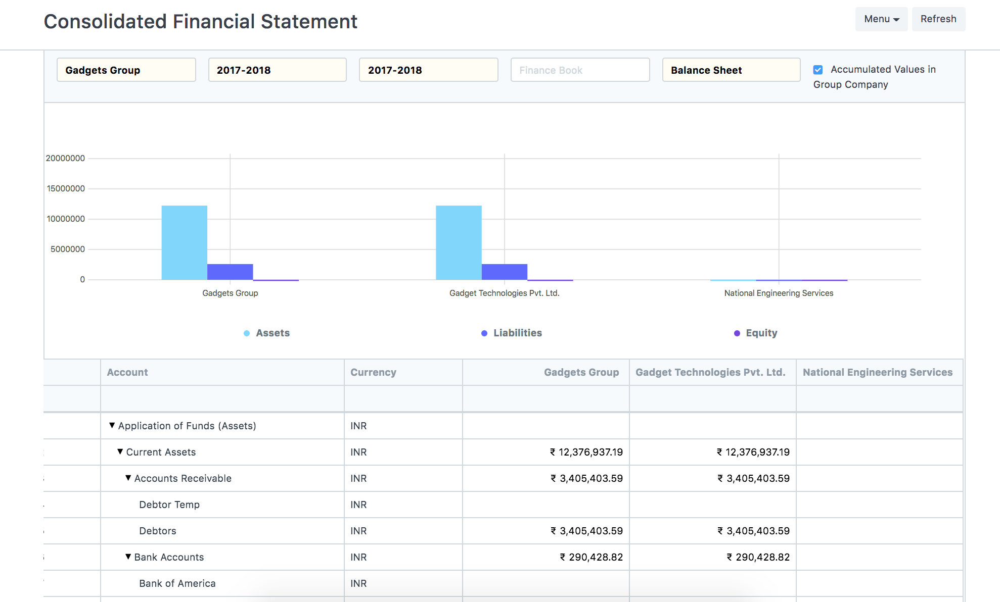

### Accounts Receivable and Accounts Payable (AR / AP)

These reports help you to track the outstanding amount of Customers and Suppliers. It also provides againg analysis i.e. a break-up of outstanding amount based on the period for which the amount is outstanding.

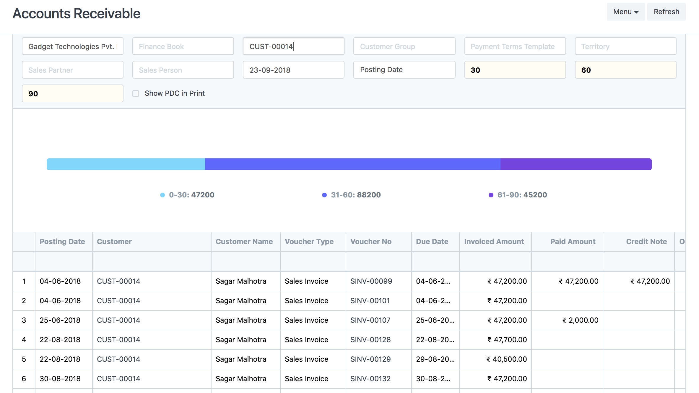

For more information on accounts receivable report based on payment terms
[Click here](./accounts-receivable.md)

### Sales and Purchase Register

The Sales and Purchase Register report shows all the Sales and Purchase transactions for a given period with invoiced amount and tax details. In this report, each taxes has a separate column, so you can easily get total taxes collected / paid for a period for each individual tax type, which helps to pay the taxes to government.

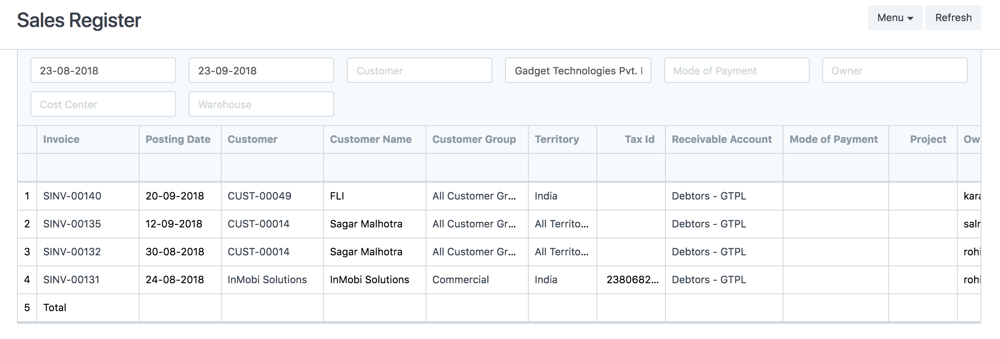

### Item wise Sales and Purchase Register

The Item Wise Sales and Purchase Register report shows all the Sales and Purchase transactions for a given period with item rate, quantity, amount and tax details. In this report, taxes has a separate column, so you can easily get individual taxes for each individual item. From this report you can have a look of which items are sold or purchase most.

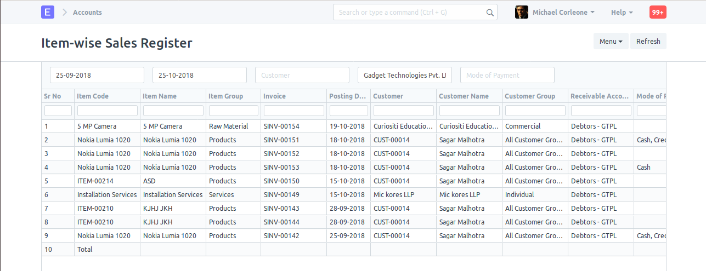

### Budget Variance

In Dooks, you can assign expense budget for an expense account against any specific cost center. This report gives a comparison between budgeted and actual expenses and the variance (the difference between the two) in monthly / quarterly / yearly view.

### GSTR-1 (India)

The GSTR-1 report helps Indian users to file monthly return of outward supplies. This report shows all the sales transactions of the company in Govt specified format. The output of the report is changed based on the selected type of business (B2B, B2C Large, B2C Small, CDNR and Export).

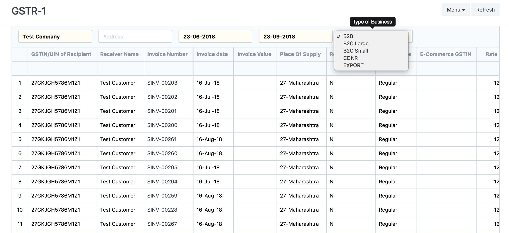

### GSTR-2 (India)

The GSTR-2 report helps Indian users to file monthly return of inward supplies. The report gives the details of all inward supplies of goods or services received during a month, in Govt specified format.

### Sales or Purchase Invoice Trends

Another very useful report is invoice trends, From this report you can easily get the trending items on monthly, quaterly, half yearly or yearly basis. You will get the idea of sales and purchase both in quantity and amount.

[Sales Invoice Trends](./assets/reports/sales-invoice-trends.png)

### Other Reports:

- **Ordered Items To Be Billed:** The report shows the items which has been ordered by customers, against which Sales
Invoice has not been created / partially been created.
- **Delivered Items To Be Billed:** The items which has been delivered to the customers, but Sales Invoice has not been created / partially been created.
- **Purchase Order Items To Be Billed:** The report shows the items which has been ordered from the suppliers, but Purchase Invoice has not been created / partially been created.
- **Received Items To Be Billed:** The items which has been received from the suppliers, but Purchase Invoice has not been created / partially been created.
- **Customer Credit Balance:** The report shows the credit limit, outstanding and credit balance for each customer.
