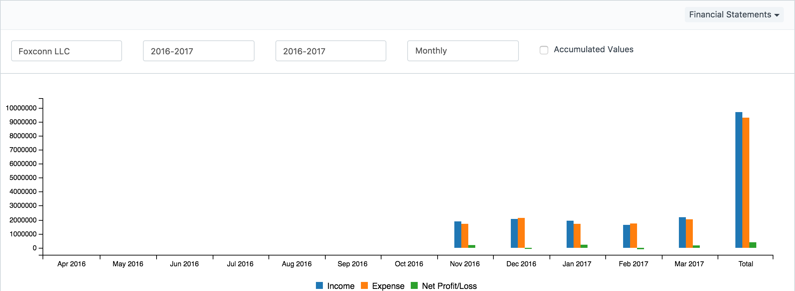
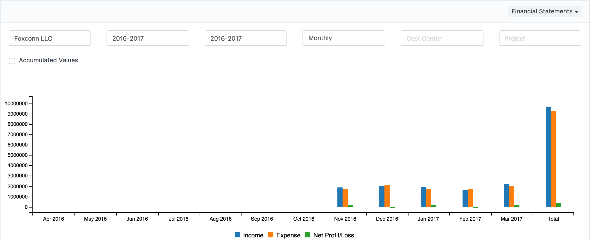
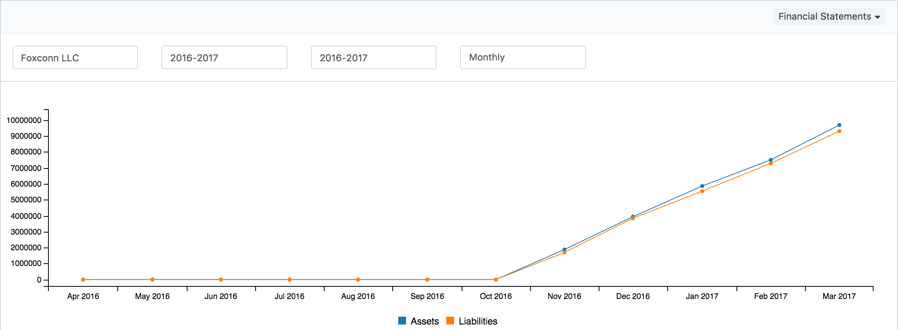
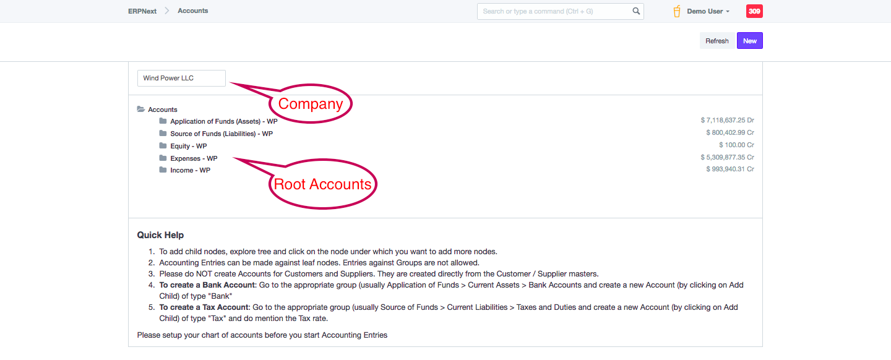
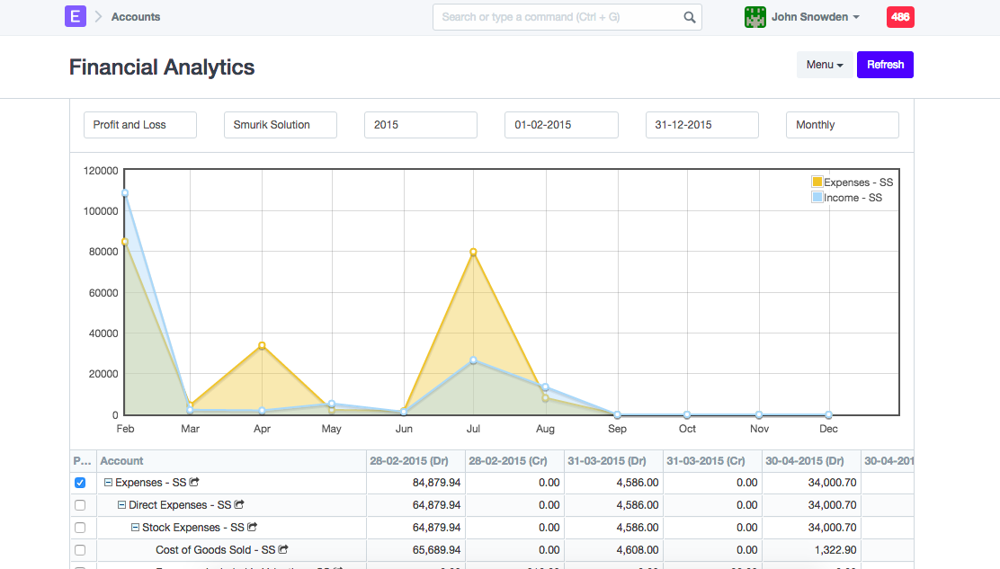

<!-- add-breadcrumbs -->
# Chart Of Accounts

The Chart of Accounts forms the blueprint of your organization. The overall
structure of your Chart of Accounts is based on a system of double entry
accounting that has become a standard all over the world to quantify how a
company is doing financially.

The Chart of Accounts helps you to answer:

  * What is your organisation worth?
  * How much debt have you taken?
  * How much profit are you making (and hence paying tax)?
  * How much are you selling?
  * What is your expense break-up

You may note that as a business manager, it is very valuable to see how well
your business is doing.

> Tip: If you can’t read a Balance Sheet (It took me a long time to
figure this out) it's a good opportunity to start learning about this. It will
be worth the effort. You can also take the help of your accountant to setup
your Chart of Accounts.

Financial statements for your company are easily viewable in Dooks. You can view financial statements
such as  Balance Sheet, Profit and Loss statement and Cash flow statement.

An Example of various financial statement are given below:

#### Cash Flow Report

#### Profit and Loss Report

#### Balance Sheet Report

To edit your Chart of Accounts in Dooks go to:

>  Accounts > Setup > Chart of Accounts

Chart of Accounts is a tree view of the names of the Accounts (Ledgers and
Groups) that a Company requires to manage its books of accounts. Dooks sets
up a simple chart of accounts for each Company you create, but you have to
modify it according to your needs and legal requirements. For each company,
Chart of Accounts signifies the way to classify the accounting entries, mostly
based on statutory (tax, compliance to government regulations) requirements.

Let us understand the main groups of the Chart of Accounts.

### Balance Sheet Accounts

The Balance Sheet has Application of Funds (/assets) and Sources of Funds
(Liabilities) that signify the net-worth of your company at any given time.
When you begin or end a financial period, all the Assets are equal to the
Liabilities.

> Accounting: If you are new to accounting, you might be wondering, how can
Assets be equal to Liabilities? That would mean the company has nothing of its
own. Thats right. All the “investment” made in the company to buy assets (like
land, furniture, machines) is made by the owners and is a liability to the
company. If the company would want to shut down, it would need to sell all the
assets and pay back all the liabilities (including profits) to the owners,
leaving itself with nothing.

All the accounts under this represent an asset owned by the company like "Bank
Account", "Land and Property", "Furniture" or a liability (funds that the
company owes to others) like "Owners funds", "Debt" etc.

Two special accounts to note here are Accounts Receivable (money you have to
collect from your customers) and Accounts Payable (money you have to pay to
your suppliers) under Assets and Liabilities respectively.

### Profit and Loss Accounts

Profit and Loss is the group of Income and Expense accounts that represent
your accounting transactions over a period.

Unlike Balance sheet accounts, Profit and Loss accounts (or PL accounts) do
not represent net worth (/assets), but rather represent the amount of money
spent and collected in servicing customers during the period. Hence at the
beginning and end of your Fiscal Year, they become zero.

In Dooks it is easy to create a Profit and Loss analysis chart. An example
of a Profit and Loss analysis chart is given below:

(On the first day of the year you have not made any profit or loss, but you
still have assets, hence balance sheet accounts never become zero at the
beginning or end of a period)

### Groups and Ledgers

There are two main kinds of Accounts in Dooks - Group and Ledger. Groups can
have sub-groups and ledgers within them, whereas ledgers are the leaf nodes of
your chart and cannot be further classified.

Accounting Transactions can only be made against Ledger Accounts (not Groups)

> Info: The term "Ledger" means a page in an accounting book where entries are
made. There is usually one ledger for each account (like a Customer or a
Supplier).

> Note: An Account “Ledger” is also sometimes called as Account “Head”.

### Account Number
A standard chart of accounts is organized according to a numerical system. Each major category will begin with a certain number, and then the sub-categories within that major category will all begin with the same number. For example, if assets are classified by numbers starting with the digit 1000, then cash accounts might be labeled 1100, bank accounts might be labeled 1200, accounts receivable might be labeled 1300, and so on. A gap between account numbers is generally maintained for adding accounts in the future.

You can assign a number while creating an account from Chart of Accounts page. You can also edit a number from account record, by clicking "Update Account Number" button. On updating account number, system renames the account name automatically to embed the number in the account name.

### Other Account Types

In Dooks, you can also specify more information when you create a new
Account, this is there to help you select that particular account in a
scenario like Bank Account or a Tax Account and has no effect on the Chart
itself.

Explanation of account types:

* **Bank** 

    The account group under which bank account will be created.

* **Cash** 

    The account group under which cash account will be created.

* **Cost of Goods Sold** 

    The account to book the accumulated total of all costs used to manufacture / purchase a product or service, sold by a company.

* **Depreciation** 

    The expense account to book the depreciation of the fixed assets.

* **Expenses Included In Valuation** 

    The account to book the expenses (apart from direct material costs) included in landed cost of an item/product, used in Perpetual Inventory.

* **Fixed Asset** 

    The account to maintain the costs of fixed assets.

* **Payable** 

    The account which represents the amount owed by a company to its creditors.

* **Receivable** 

    The account which represents the amount owed to a company by its debtors.

* **Stock** 

    The account group under which the warehouse account will be created.

* **Stock Adjustment** 

    An expense account to book any adjustment entry of stock/inventory. Generally comes at the same level of Cost of Goods Sold.

* **Stock Received But Not Billed** 

    A temporary liability account which holds the value of stock received but not billed yet and used in Perpetual Inventory.

### Creating / Editing Accounts

To create new Accounts, explore your Chart of Accounts and click on an Account
group under which you want to create the new Account. On the right side, you
will see an option to “Open” or “Add Child” a new Account.

Option to create will only appear if you click on a Group (folder) type
Account. There you need to enter account name, account number and some more
optional details.

Dooks creates a standard structure for you when the Company is created but
it is up to you to modify or add or remove accounts.

Typically, you might want to create Accounts for

  * Travel, salaries, telephone, etc. under **Expenses**.
  * Value Added Tax (VAT), Sales Tax, etc. under **Current Liabilities**.
  * Product Sales, Service Sales, etc. under **Income**.
  * Building, machinery, furniture, etc. under **Fixed Assets**.

  

    <iframe src='https://www.youtube.com/embed//AcfMCT7wLLo' frameborder='0' allowfullscreen>
    </iframe>
  

{next}
